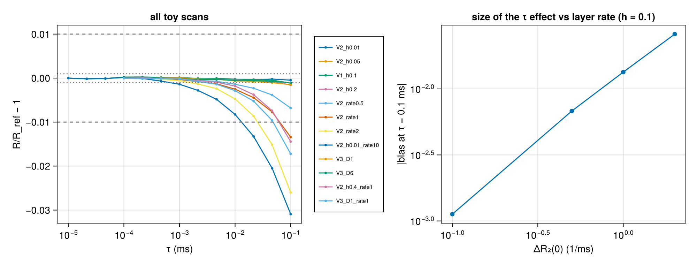
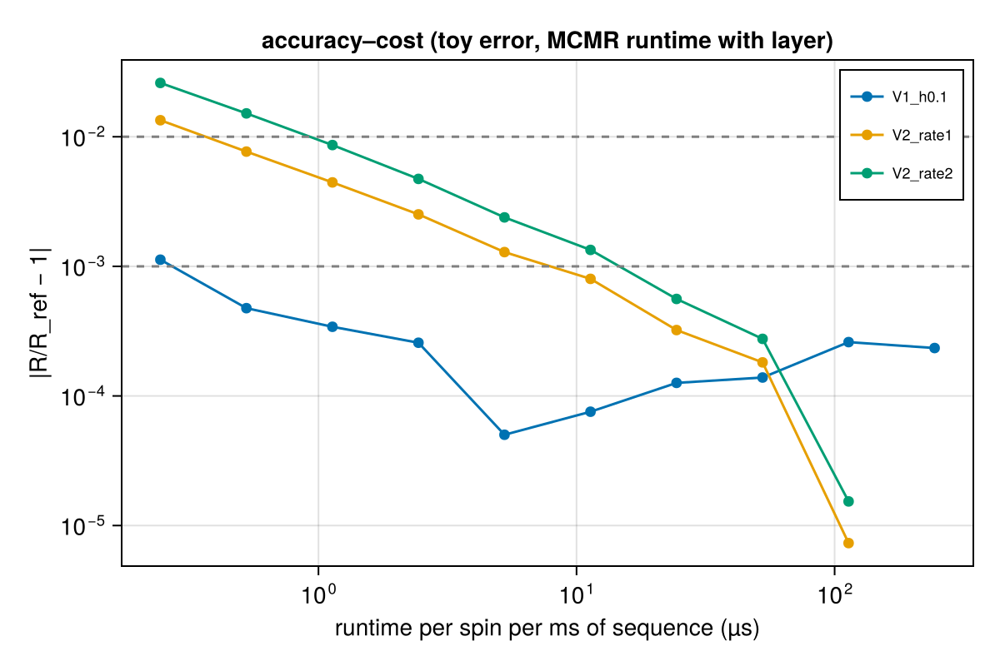
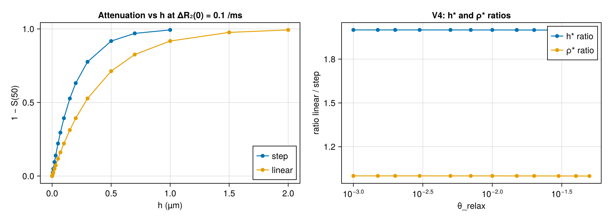
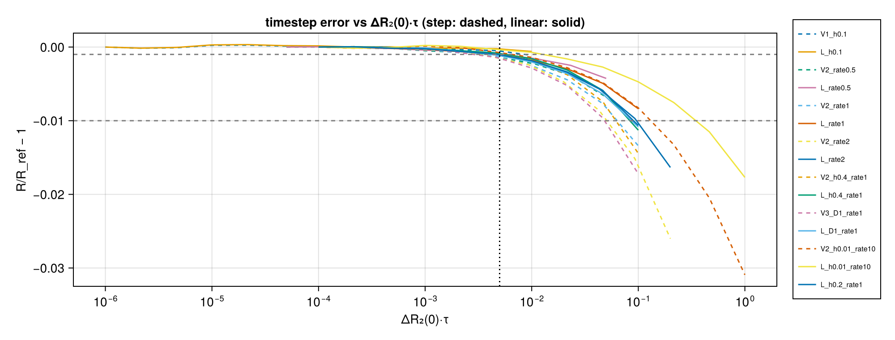

# Phase 2 · Record (R₂(d) on walls, step profile, no RF)

Results of the modified simulator (branch `cc/near-surface-r2`, layer implemented by plan `docs/superpowers/plans/2026-10-01-near-surface-layer-walls.md`).
Baselines are in [baseline_record.md](baseline_record.md). The baseline θ_relax model is a **reference**, not the true answer.

- Code: [research/phase2/](phase2/) (harness, expectations, scripts); tests: `julia --project=research/baseline -t 8 research/phase2/test/runtests.jl`
- Raw outputs: [research/results/phase2/](results/phase2/), each with `summary.json` (provenance: git commit, versions, hardware)

**Reference configuration:** `Walls(repeats=2)` (w = 2 µm), D = 3 µm²/ms, no RF, spins start transverse in a ±500 µm box, readouts 0, 5, …, 50 ms, τ = 1e-2 ms, seeds 1–10, 10⁵ spins per seed, step-profile layer on both faces, ΔR₂(0) = 0.1 ms⁻¹ (ρ = ΔR₂(0)·h), R₂_bulk = 0 unless stated. Uncertainty of a mean = SEM over seeds.

## Summary

| ID | Test | Criterion | Outcome |
|---|---|---|---|
| P2.2.9 | Single-spin trace with the layer on | every step: \|M⊥_sim/M⊥_pred − 1\| ≤ 1e-6; ≥ 1 reflection inside the layer | **PASS**: max error 5.0e-08; 4848 steps with a reflection inside the layer |
| P2.1.3 | Harness reproduces B1, B2 and one B4 curve (same seeds) | exact / CSV precision | **PASS**: B1 = 1 exactly, B2 = e^(−t/80) to 1e-11, B4 θ = 0.01 curve to 1e-8 (`research/phase2/test/`) |
| P2.1.5 | Exact expectations and B4 interpolation | unit-tested before any run | **Done**: `research/phase2/expected.jl` (21 tests) |
| P2.1.4 | Noise floor and spin count | neighbouring h in the sweep differ by > 10 SEM | σ(50) = 4.8e-05 (h = 0.1), 1.6e-05 (h = 0.5); worst neighbour separation 4287 SEM → **100000** spins per seed (no increase needed) |
| P2.3.1 | V0b: ρ = 0 vs no layer (bulk off / on), default τ | bit-identical positions and M⊥ | **PASS** / **PASS** |
| P2.3.4(a) | Exact end point h = w/2 (bulk off / on) | per spin ≤ 1e-10; ensemble ≤ roundoff bound | **PASS** / **PASS**: per spin ≤ 1.4e-13, ensemble ≤ 2.6e-12 |
| P2.3.11 | Additivity R₂_bulk + ΔR₂ (h = 0.2 µm) | same positions; per spin ≤ 1e-10; ensemble ≤ roundoff bound | **PASS**: per spin 6.6e-14, ensemble 7.5e-14 |
| P2.3.2 | V9 density with the layer on (τ = 0.04, 1e-2) | positions == no-layer run; histogram \|z_χ²\| ≤ 3 | **PASS** |
| P2.3.3 | Occupancy within h of either face (**gate**) | fraction = 2h/w, \|z\| ≤ 2 for h = 0.05–0.5 | **PASS** |
| P2.3.4(b) | Attenuation vs h (characterisation), τ = 1e-2 | recorded with SEM | S(50) from 1 (h = 0) to 0.00674 (h = 1.0); 100000 spins × 10 seeds |
| P2.3.5 | Monotonicity in h (proposal §3.2 VI) | every step > 2 combined SEM | **PASS**: 13 of 13 steps |
| P2.3.6 | Decay shape (curvature of ln S) | characterisation | curvature 0 within noise at every h (\|c\| ≤ 5e-08 ms⁻², ≤ 1.3 SEM) |
| P2.3.7 | V11: endpoint rule vs exact overlap (toy, h = 0.1) | bias quantified (sign not assumed); toy exact = MCMR within 2 SEM | bias at τ = 1e-3 / 1e-2 / 4e-2: -0.1 / -1.4 / +5.2 SEM; cross-check **PASS** (+1.8 SEM) |
| P2.3.12 | Side-specific layer: exact mirror check + characterisation | positive layer on −x walls == negative layer on +x walls (identical) | **PASS** (bit-identical); paired statistical difference reported (max 3.2 SEM, 1.3 SEM at 50 ms); S(50): both 0.36847, one side 0.60771, asymmetric 0.36834 |
| P2.3.9 | V4: h*(θ) fit to the B4 reference (τ = 1e-2, ΔR₂(0) = 0.1) | h* found for every θ, with uncertainty and residuals (no pass/fail) | **12 of 12 θ fitted**; h* from 0.00977 to 0.48681 µm; at h* the model matches the reference curve within 4e-05 relative (≤ 0.4 combined SEM) at every readout |
| P2.4.3 (trace) | Single-spin trace, linear profile | every step: \|M⊥_sim/M⊥_pred − 1\| ≤ 1e-6; ≥ 1 reflection inside the layer | **PASS**: max error 2.4e-12; 4848 steps with a reflection inside the layer |
| P2.4.3 (exact) | Linear profile: V0b, uniform case h = w (bulk off / on), additivity | bit-identical; per spin ≤ 1e-10; ensemble ≤ roundoff bound | **PASS** (all four): uniform per spin ≤ 1.4e-13, ensemble ≤ 2.6e-12; additivity 6.5e-14 / 8.7e-14 |
| P2.4.3 (sweep) | Linear profile: attenuation vs h, monotonicity, decay shape (τ = 1e-2) | every step > 2 SEM; curvature reported | **PASS**: 15 of 15 steps; curvature 0 within noise (max 1.3 SEM); S(50) from 1 to 0.00674 (h = 2.0) |
| P2.4.7 (linear) | V4: h*(θ) of the linear profile fitted to B4 (τ = 1e-2, ΔR₂(0) = 0.1) | h* found for every θ, uncertainty and residuals (no pass/fail) | **12 of 12 θ fitted**; h* from 0.01954 to 0.97272 µm; whole curve matched within 5e-05 relative (≤ 0.5 combined SEM) |
| P2.4.8 (step vs linear) | Profile comparison at fixed ΔR₂(0) (characterisation) | differences reported with σ | ρ* agrees within 9.2e-4 (h* ratio 1.998–2.000), with a small drift (linear below step) growing with θ, z up to −2.4 (conservative); both fit every θ within 0.5 SEM |
| P2.4.5 (trace) | Single-spin trace, exponential profile (cutoff = w) | every step ≤ 1e-6; ≥ 1 reflection inside the layer | **PASS**: max error 7.1e-13; 4848 steps with a reflection inside the layer |
| P2.4.5 (identity) | Mean-exponent identity E[−ln M] = 2ρt/w, step / linear (incl. overlapping h = 1.5) / exponential, τ = 1e-2 and 4e-2 | \|z\| ≤ 3 | **PASS** (10 of 10; \|z\| ≤ 1.1) |
| P2.4.5 (sweep) | Exponential profile: attenuation vs h, monotonicity, decay shape (τ = 1e-2) | every step > 2 SEM; curvature reported | **PASS**: 15 of 15 steps; curvature 0 within noise (max 1.1 SEM); S(50) from 1 to 0.00180 (h = 2.0) |
| P2.6.1 | V1: timestep plateau (toy, h = 0.1, ΔR₂(0) = 0.1, τ = 1e-5–0.1 ms) + MCMR at 4 τ | τ_conv at 1 % / 0.1 %; MCMR = toy within 2 SEM | 1 % never exceeded (τ_conv ≥ 0.1 ms); τ_conv(0.1 %) = 0.086 ms; bias at 0.1 ms −1.1e-3 (less attenuation); MCMR vs toy **PASS** (\|z\| ≤ 1.3) |
| P2.6.2, P2.6.3 | V2 (h²) and V3 (1/D) scaling of τ_conv; decision point (rate) | τ_conv·D/h² and τ_conv·D constant within ±30 % | **V2 FAIL, V3 FAIL** (no h² or 1/D scaling; h/D trends at ΔR₂(0) = 0.1 within noise). τ_conv set by ΔR₂(0)·τ: 0.048–0.13 (1 %), 0.0028–0.0065 (0.1 %) over h = 0.01–0.4, D = 1–3; bias at 0.1 ms ∝ ΔR₂(0) |
| P2.6.4 | Profile dependence of the timestep error (linear vs step, toy + MCMR check) | record whether the constraint depends on shape | linear less demanding in every pair (bias at 0.1 ms 0.53–0.78× step); error at c = 0.005 at most 1.2e-3 ± 3e-4 (linear), 1.5e-3 ± 4e-4 (step), 8.3e-4 ± 2e-4 (exponential) → same c for all three; MCMR = toy for linear (\|z\| ≤ 1.3) |
| P2.6.5 | Layer constraint in the simulator's timestep | constraint active; binding term reported | **Done** (user decision): option `layer`, τ ≤ c/ΔR₂(0)_max, default c = 0.005; verbose message names it when it binds; suite 2894/2894 |
| P2.6.8, P2.6.10–P2.6.12 | Cost with the layer; consequences for τ = 1e-2 results | cost tabulated; earlier results judged | layer overhead ×1.2–1.4 vs B5 (×2.1 at h = 0.01); full run ≤ 0.11 h up to ΔR₂(0) = 2, 0.63 h at 10; all earlier τ = 1e-2 results (ΔR₂(0) = 0.1) biased ≤ 6.4e-4 in R → **no reruns needed** |

## P2.2.9: single-spin trace with the layer on

Script [p2_2_9_layer_trace.jl](phase2/p2_2_9_layer_trace.jl) → [results/phase2/p2_2_9_layer_trace/](results/phase2/p2_2_9_layer_trace/) (`trace_spin1.csv`: every step of spin 1)

**What / why.** The P1.2.6 trace repeated with the layer on. Each step's change in M⊥ is predicted from the simulator's own reflected path, with the layer time on every straight piece computed by brute-force sampling (10⁴ points per piece), independently of the `Layers` code. Agreement shows that distance, crossings, reflection handling, segmentation and the M⊥ update (P2.2.1–P2.2.7) work together.

| Field | Value |
|---|---|
| Configuration | walls every 2 µm; step layer on both faces, h = 0.5 µm, ΔR₂(0) = 0.1 ms⁻¹; R₂_bulk = 1/80 ms⁻¹; D = 3 µm²/ms; τ = 0.01 ms |
| Spins / steps | 100 spins × 500 steps (50 000 steps); `Random.seed!(20261003)` |
| Max relative error per step | **5.0e-08** (tolerance 1e-6; the sampling resolution is about 1e-7 per step, so this is sampling error) |
| Steps with a reflection inside the layer | 4848 |
| Runtime | ≈ 15 s (1 thread) |
| Outcome | **PASS** |

## P2.1.4: noise floor and spin count

Script [p2_1_4_noise_floor.jl](phase2/p2_1_4_noise_floor.jl) → [results/phase2/p2_1_4_noise_floor/](results/phase2/p2_1_4_noise_floor/) (`pilot_pairs.csv`)

| h (µm) | S(50) | σ(50) (one seed) | SEM(50) (10 seeds) | max σ over readouts | runtime (10 seeds) |
|---|---|---|---|---|---|
| 0.1 | 0.60686 | 4.78e-05 | 1.51e-05 | 6.58e-05 | 73 s |
| 0.5 | 0.08240 | 1.56e-05 | 4.93e-06 | 9.00e-05 | 79 s |

Pilot sweep (3 seeds, 10⁵ spins): the closest pair of neighbouring h values (0.02 → 0.03 µm) is separated by **4287 SEM**, far above the required 10, so the sweep keeps **100000 spins per seed**. The per-spin variance is small because every spin spends a similar fraction of 50 ms in the layer.

H_GRID coverage of the B4 range (1 − S(50) from 0.048 to 0.912): pilot 1 − S(50) = 0.0488 at h = 0.01 and 0.9176 at h = 0.5 → **covered**; h = 1.0 gives S(50) = 0.00674 (= e⁻⁵ = 0.00674, the exact end point).

## P2.3.1, P2.3.4(a), P2.3.11: exact checks at full size

Script [p2_3_exact_checks.jl](phase2/p2_3_exact_checks.jl) → [results/phase2/p2_3_exact_checks/](results/phase2/p2_3_exact_checks/)

These hold in any diffusion regime, so they are pass/fail to floating-point precision. Same seeds (1–10) and 100000 spins per seed throughout.

| Check | Configuration | Max deviation per spin | Max deviation ensemble | Bound | Outcome |
|---|---|---|---|---|---|
| V0b, bulk off | ρ = 0, h = 0.5 vs no layer; default τ = 0.04 ms | identical (==) | identical | — | **PASS** |
| V0b, bulk on (1/80) | same | identical (==) | identical | — | **PASS** |
| h = w/2, bulk off | h = 1.0, ΔR₂(0) = 0.1, τ = 1e-2 | 8.5e-14 | 2.6e-12 | 2.3e-11 | **PASS** |
| h = w/2, bulk on | same + R₂_bulk = 1/80 | 1.4e-13 | 1.9e-12 | 2.3e-11 | **PASS** |
| additivity | h = 0.2, ΔR₂(0) = 0.1, R₂_bulk 0 vs 1/80; positions identical: True | 6.6e-14 | 7.5e-14 | 2.3e-11 | **PASS** |

## P2.3.2, P2.3.3: density and occupancy with the layer on

Script [p2_3_2_density_occupancy.jl](phase2/p2_3_2_density_occupancy.jl) → [results/phase2/p2_3_2_density_occupancy/](results/phase2/p2_3_2_density_occupancy/)

The layer changes |Mxy| only, so final positions with the layer on (h = 0.5 µm, ΔR₂(0) = 0.1 ms⁻¹) are compared with the no-layer run (same seeds); the B3 statistics are then recomputed on the layer-on positions at t = 50 ms (10⁶ spins pooled).

| τ (ms) | Positions identical to no layer | χ²/dof (z) | Occupancy z for h = 0.05 / 0.1 / 0.2 / 0.4 / 0.5 | Outcome |
|---|---|---|---|---|
| 0.04 (default) | True | 0.948 (-0.36) | +0.08 / +0.09 / -1.03 / -0.90 / -0.58 | **PASS** |
| 1e-2 | True | 0.949 (-0.36) | -0.01 / +0.54 / -0.37 / -1.52 / -1.11 | **PASS** |

At the default τ the histogram statistic equals B3's value at t = 50 ms (χ²/dof 0.948), as expected: same seeds, same positions.

## P2.3.4(b), P2.3.5, P2.3.6: h sweep

Script [p2_3_4_h_sweep.jl](phase2/p2_3_4_h_sweep.jl) → [results/phase2/p2_3_4_h_sweep/](results/phase2/p2_3_4_h_sweep/) (`sweep.csv` per seed, figure `p2_3_4_h_sweep.png`). Step profile, both faces, ΔR₂(0) = 0.1 ms⁻¹, τ = 1e-2 ms (provisional until P2.6), 100000 spins × 10 seeds.

| h (µm) | S(25) | S(50) ± SEM | 1 − S(50) | curvature c ± SEM (ms⁻²) |
|---|---|---|---|---|
| 0.0 | 1.00000 | 1.00000 ± 0.0e+00 | 0.00000 | -0.0e+00 ± 0.0e+00 |
| 0.005 | 0.98758 | 0.97531 ± 1.9e-06 | 0.02469 | 1.7e-09 ± 1.4e-09 |
| 0.01 | 0.97531 | 0.95123 ± 3.9e-06 | 0.04877 | 3.7e-09 ± 2.8e-09 |
| 0.02 | 0.95124 | 0.90486 ± 6.1e-06 | 0.09514 | 6.5e-09 ± 6.1e-09 |
| 0.03 | 0.92777 | 0.86076 ± 7.7e-06 | 0.13924 | 7.9e-09 ± 8.6e-09 |
| 0.05 | 0.88256 | 0.77893 ± 9.8e-06 | 0.22107 | 1.1e-08 ± 1.4e-08 |
| 0.07 | 0.83957 | 0.70489 ± 1.2e-05 | 0.29511 | 1.7e-08 ± 1.9e-08 |
| 0.1 | 0.77900 | 0.60686 ± 1.5e-05 | 0.39314 | 2.7e-08 ± 2.5e-08 |
| 0.15 | 0.68764 | 0.47286 ± 1.5e-05 | 0.52714 | 2.7e-08 ± 3.7e-08 |
| 0.2 | 0.60701 | 0.36847 ± 1.6e-05 | 0.63153 | 3.0e-08 ± 4.8e-08 |
| 0.3 | 0.47300 | 0.22374 ± 1.2e-05 | 0.77626 | 4.5e-08 ± 6.7e-08 |
| 0.5 | 0.28705 | 0.08240 ± 4.9e-06 | 0.91760 | 4.5e-08 ± 7.1e-08 |
| 0.7 | 0.17401 | 0.03028 ± 1.6e-06 | 0.96972 | 3.3e-08 ± 5.5e-08 |
| 1.0 | 0.08208 | 0.00674 ± 2.9e-19 | 0.99326 | -4.5e-16 ± 0.0e+00 |

**Interpretation.**
- Attenuation rises with h at every step (13 of 13, each by thousands of SEM) → **P2.3.5 PASS** (proposal §3.2 VI: fixed profile and ΔR₂(0), larger h gives more attenuation).
- ln S(t) is a straight line at every h: the fitted curvature is zero within 1.3 SEM everywhere, so in this configuration (w = 2 µm, D = 3, up to 50 ms) the decay of the whole ensemble is single-exponential at this precision. h = 0 and h = w/2 = 1.0 are exactly single-exponential by construction.
- An empirical observation (not an assumption used anywhere): S(50) is close to exp(−ΔR₂(0)·(2h/w)·50 ms), i.e. ΔR₂(0) weighted by the measured layer occupancy 2h/w (P2.3.3):

| h (µm) | occupancy 2h/w | S(50) simulated | exp(−ΔR₂(0)·(2h/w)·50) |
|---|---|---|---|
| 0.005 | 0.0050 | 0.97531 | 0.97531 |
| 0.01 | 0.0100 | 0.95123 | 0.95123 |
| 0.02 | 0.0200 | 0.90486 | 0.90484 |
| 0.03 | 0.0300 | 0.86076 | 0.86071 |
| 0.05 | 0.0500 | 0.77893 | 0.77880 |
| 0.07 | 0.0700 | 0.70489 | 0.70469 |
| 0.1 | 0.1000 | 0.60686 | 0.60653 |
| 0.15 | 0.1500 | 0.47286 | 0.47237 |
| 0.2 | 0.2000 | 0.36847 | 0.36788 |
| 0.3 | 0.3000 | 0.22374 | 0.22313 |
| 0.5 | 0.5000 | 0.08240 | 0.08208 |

It agrees to 4–5 digits for thin layers and drifts slightly for thicker ones (0.08240 vs 0.08209 at h = 0.5). This is a description of this geometry and diffusivity only. The differences from the baseline are what V4 measures.

## P2.3.7: V11, endpoint rule vs exact overlap

Script [p2_3_7_endpoint.jl](phase2/p2_3_7_endpoint.jl) → [results/phase2/p2_3_7_endpoint/](results/phase2/p2_3_7_endpoint/). 1D toy walk identical to MCMR's x-motion between walls ([toy.jl](phase2/toy.jl)); h = 0.1 µm, ΔR₂(0) = 0.1 ms⁻¹, T = 50 ms, seeds 1–10. The **exact** rule integrates the layer time along every reflected straight piece (as MCMR does); the **endpoint** rule charges a whole step to the layer if the step's end point is inside it.

| τ (ms) | spins per seed | S(50) exact ± SEM | S(50) endpoint ± SEM | bias (endpoint − exact) | bias in SEM |
|---|---|---|---|---|---|
| 0.001 | 20000 | 0.60679 ± 2.6e-05 | 0.60678 ± 2.5e-05 | -4.9e-06 | -0.1 |
| 0.01 | 100000 | 0.60690 ± 1.4e-05 | 0.60687 ± 1.1e-05 | -2.5e-05 | -1.4 |
| 0.04 | 100000 | 0.60707 ± 1.9e-05 | 0.60721 ± 1.8e-05 | +1.4e-04 | +5.2 |

Cross-check: toy exact vs MCMR (P2.3.4(b), h = 0.1, τ = 1e-2): 0.60690 vs 0.60686 (+1.8 SEM) → **PASS** (independent random streams, so the check is statistical).

**Interpretation.**
- The endpoint rule's bias is small here and **changes sign with τ**: indistinguishable from zero at τ = 1e-3 ms, slightly negative (more attenuation) at 1e-2, and positive (less attenuation, +1.4 × 10⁻⁴) at 4e-2 ms. The tracker's expectation "endpoint under-counts" is therefore not confirmed as a general rule for this configuration; the bias depends on τ and is small because the end points of steps sample the layer occupancy without bias in a uniform ensemble.
- The exact rule itself also moves with τ (S(50) = 0.60679 → 0.60690 → 0.60707 for τ = 1e-3 → 1e-2 → 4e-2 ms, i.e. +4.6 × 10⁻⁴ relative over the range). That is the straight-line timestep effect of the proposal §3.2 V, to be quantified in V1 (P2.6). At τ = 1e-2 it is +1.8 × 10⁻⁴ relative to τ = 1e-3, larger than the 10⁻⁵ SEM, so results at τ = 1e-2 are not yet timestep-converged at this precision.

## P2.3.12: side-specific layer

Script [p2_3_12_sides.jl](phase2/p2_3_12_sides.jl) → [results/phase2/p2_3_12_sides/](results/phase2/p2_3_12_sides/) (first version kept in `first_pass/`). h = 0.2 µm, ΔR₂(0) = 0.1 ms⁻¹ unless stated; asymmetric: positive h = 0.2 / ΔR₂(0) = 0.1, negative h = 0.4 / ΔR₂(0) = 0.05 (same ρ = 0.02 µm/ms on both sides).

| Case | S(25) ± SEM | S(50) ± SEM |
|---|---|---|
| both sides | 0.60701 ± 2.0e-05 | 0.36847 ± 1.6e-05 |
| positive only | 0.77959 ± 2.4e-05 | 0.60771 ± 2.8e-05 |
| negative only | 0.77948 ± 2.4e-05 | 0.60765 ± 2.4e-05 |
| asymmetric | 0.60691 ± 1.9e-05 | 0.36834 ± 1.5e-05 |

**Exact mirror check → PASS.** A positive-side layer on walls whose normal points along −x is geometrically the same as a negative-side layer on walls along +x. With the same seeds the two runs give **bit-identical** signals at every readout (and identical positions), so the code treats the two sides exactly symmetrically.

**Statistical mirror comparison (reported, not graded).** Positive-only minus negative-only on the same +x walls, paired per seed, z at t = 5…50 ms: -0.8 / -0.4 / +0.3 / +2.1 / +2.7 / +3.2 / +2.2 / +2.3 / +2.0 / +1.3. The difference is at most 1.1 × 10⁻⁴ (relative 2 × 10⁻⁴), changes sign between early and late readouts, and is 1.3 SEM at 50 ms. Because the exact check rules out the code, this is a property of the finite spin sample carried through strongly correlated readouts (the same spins at every time).

**Criterion change (recorded).** The plan graded the statistical comparison as "|z| ≤ 2 at every readout", with unpaired SEMs. The first run gave max |z| = 3.15 → FAIL (kept in `first_pass/`). That criterion was mis-specified: the two runs share their spins, and 11 correlated readouts were each required to stay within 2σ. The pass criterion is now the exact flipped-normal identity, which tests the code directly.

**Characterisation.** Layers on both sides attenuate more than a layer on one side (0.368 vs 0.608 at 50 ms). The asymmetric layer, with the same ρ on both sides but different h and ΔR₂(0), gives almost the same S(50) as the symmetric one (0.36834 vs 0.36847, a 1.3 × 10⁻⁴ difference that is resolved at this precision). No baseline exists for asymmetric surfaces, because MCMR's θ_relax is the same on both sides.

## P2.3.9: V4, h*(θ) fitted to the baseline reference

Scripts [p2_3_9_fit_h.jl](phase2/p2_3_9_fit_h.jl) (start and parabola refinement) and [p2_3_9b_gauss_newton.jl](phase2/p2_3_9b_gauss_newton.jl) (final step) → [results/phase2/p2_3_9_fit_h/](results/phase2/p2_3_9_fit_h/) (`h_star_final.csv`, figure `p2_3_9_fit_h.png`; earlier stages in `first_pass/` and `parabola_pass/`). Step profile, both faces, ΔR₂(0) = 0.1 ms⁻¹, τ = 1e-2 ms, seeds 1–10, 10⁵ spins. The baseline is a reference, not the truth: residuals show where the two models differ.

**Method (three stages, recorded as rulings).**
1. Start: h from the P2.3.4(b) sweep, S(t; h) interpolated linearly in h. The residuals of direct runs at this h were 8–660 SEM. That was interpolation error between grid points, because the SEM (about 10⁻⁵) is far below the interpolation accuracy (`first_pass/`).
2. Parabola: χ² from direct runs at h·(1 − 5%, 1, 1 + 5%), vertex as the new h. The residuals still had one sign at every θ (up to 23 SEM), so this was not yet the minimum at this precision (`parabola_pass/`). The jackknife σ(h*) below comes from this stage.
3. One Gauss–Newton step (slope dS/dh from the sweep), then a final direct run. Residuals are now mixed in sign and below 0.4 SEM everywhere.

| θ_relax | h* (µm) | σ_jack (µm) | h*/θ | χ²/dof | max \|residual\| (SEM) | max \|S_model/S_ref − 1\| | S(50) reference | S(50) model |
|---|---|---|---|---|---|---|---|---|
| 0.001 | 0.00977 | 4e-06 | 9.772 | 0.05 | 0.4 | 1.9e-06 | 0.95232 | 0.95232 |
| 0.0015 | 0.01466 | 4e-06 | 9.772 | 0.04 | 0.4 | 2.3e-06 | 0.92934 | 0.92934 |
| 0.002 | 0.01954 | 8e-06 | 9.772 | 0.03 | 0.3 | 2.6e-06 | 0.90692 | 0.90692 |
| 0.003 | 0.02932 | 5e-06 | 9.773 | 0.02 | 0.3 | 2.5e-06 | 0.86369 | 0.86370 |
| 0.005 | 0.04887 | 2e-05 | 9.773 | 0.02 | 0.2 | 2.5e-06 | 0.78335 | 0.78335 |
| 0.007 | 0.06841 | 3e-05 | 9.773 | 0.03 | 0.4 | 5.3e-06 | 0.71051 | 0.71051 |
| 0.01 | 0.09772 | 5e-05 | 9.772 | 0.02 | 0.3 | 7.7e-06 | 0.61379 | 0.61380 |
| 0.015 | 0.14655 | 4e-05 | 9.770 | 0.01 | 0.1 | 6.7e-06 | 0.48106 | 0.48106 |
| 0.02 | 0.19534 | 3e-05 | 9.767 | 0.03 | 0.2 | 1.2e-05 | 0.37713 | 0.37713 |
| 0.03 | 0.29277 | 6e-05 | 9.759 | 0.03 | 0.2 | 1.7e-05 | 0.23196 | 0.23196 |
| 0.04 | 0.38994 | 3e-04 | 9.748 | 0.04 | 0.3 | 2.9e-05 | 0.14281 | 0.14281 |
| 0.05 | 0.48681 | 2e-04 | 9.736 | 0.05 | 0.3 | 4.0e-05 | 0.08802 | 0.08802 |

**Timestep check** (h* fixed at the parabola value, τ = 1e-2 → 1e-3 ms, S(50) shift): θ = 0.002: +0.38 SEM (+3.6e-06); θ = 0.01: -0.99 SEM (-3.8e-05); θ = 0.05: -1.00 SEM (-1.2e-04). At these h the fitted model moves by at most about 1 SEM when τ is reduced tenfold.

**Bulk on** (θ = 0.01, R₂_bulk = 1/80, at the parabola h*): the residuals equal the bulk-off residuals at the same h (max 15.79 in both), as expected from the exact factorisation (P2.3.11).

**Caveat.** Model and reference share seeds 1–10 (same initial positions), so √(SEM₁² + SEM₂²) overestimates the noise of their difference. That is why χ²/dof is far below 1. Residuals in SEM are therefore conservative.

**Interpretation.**
- For every θ in the B4 grid, a single layer thickness h* reproduces the **whole** baseline curve S_θ(t), 0–50 ms, to within a few 10⁻⁵ relative. In this configuration (walls 2 µm apart, D = 3 µm²/ms, up to 50 ms) the step-profile layer and the baseline θ_relax model cannot be told apart from the signal once h is fitted. Any difference in curve shape is below about 10⁻⁵.
- h* is almost exactly proportional to θ: h*/θ = 9.74–9.77 µm per unit θ over the whole range, drifting by 0.3% from the smallest to the largest θ. Equivalently, the fitted integrated relaxivity ρ* = ΔR₂(0)·h* = 0.974–0.977·θ in these units. This is an empirical result of the fit, reported as found.
- Whether the shape of the decay ever distinguishes the two models (narrower gaps, thicker layers, other profiles, curved geometry) is the subject of the shape comparison (P2.5) and Phase 3.

## Gate for section 2.4 (2026-10-03)

P2.2.9 single-spin trace: **PASS**. P2.3.3 occupancy: **PASS**. P2.3.4(a) exact end point h = w/2: **PASS**. → Section 2.4 (other profiles) may start. Characterisation results above are at τ = 1e-2 ms. The V4 timestep check moved the fitted model by at most about 1 SEM, while the V11 toy shows a τ-shift of the exact rule of order 10⁻⁴ relative. The timestep study (P2.6) settles convergence.

## P2.6.1: V1, timestep plateau

Toy 1D walk (exact segment rule, step profile, both faces, w = 2 µm, D = 3 µm²/ms), h = 0.1 µm, ΔR₂(0) = 0.1 ms⁻¹, T = 10 ms, 100000 spins × 10 seeds, τ = 1e-5 … 0.1 ms (3 per decade). Observable R = −ln S(T_eff)/T_eff; reference = τ = 1e-5. Script `research/phase2/p2_6_scan.jl`; output `research/results/phase2/p2_6_scan_V1_h0.1/`.

| τ (ms) | R (ms⁻¹) | SEM | R/R_ref − 1 |
|---|---|---|---|
| 1e-5 | 9.98899e-03 | 1.1e-06 | 0 |
| 2.15e-5 | 9.98741e-03 | 8.7e-07 | −1.6e-04 |
| 4.64e-5 | 9.98803e-03 | 1.5e-06 | −9.6e-05 |
| 1e-4 | 9.99133e-03 | 1.7e-06 | +2.3e-04 |
| 2.15e-4 | 9.99159e-03 | 1.3e-06 | +2.6e-04 |
| 4.64e-4 | 9.99037e-03 | 1.2e-06 | +1.4e-04 |
| 1e-3 | 9.99025e-03 | 1.5e-06 | +1.3e-04 |
| 2.15e-3 | 9.98823e-03 | 1.1e-06 | −7.6e-06 |
| 4.64e-3 | 9.98849e-03 | 1.3e-06 | +5.0e-05 |
| 1e-2 | 9.98642e-03 | 1.6e-06 | −2.6e-04 |
| 2.15e-2 | 9.98557e-03 | 1.6e-06 | −3.4e-04 |
| 4.64e-2 | 9.98424e-03 | 1.7e-06 | −4.8e-04 |
| 0.1 | 9.97774e-03 | 1.5e-06 | −1.13e-03 |

- τ_conv at 1 %: **≥ 0.1 ms** (no τ in the range fails; lower bound). τ_conv at 0.1 %: **0.086 ms**.
- Bias at the largest τ: −1.13e-3 relative, i.e. **less attenuation** at large τ, the sign the proposal (§3.2 V) expects.
- Points from 1e-5 to 1e-3 scatter by up to ±2.6e-4 (about 2 SEM): this is the precision floor of the scan, and it is below the 0.1 % tolerance.

**MCMR confirmation** (`p2_6_1_mcmr_check.jl`, same configuration, 100000 spins × 10 seeds, independent random stream):

| τ (ms) | R MCMR | R toy | z |
|---|---|---|---|
| 0.1 | 9.97614e-03 ± 2.0e-06 | 9.97774e-03 ± 1.5e-06 | −0.65 |
| 1e-2 | 9.98929e-03 ± 1.5e-06 | 9.98642e-03 ± 1.6e-06 | +1.31 |
| 1e-3 | 9.99003e-03 ± 1.1e-06 | 9.99025e-03 ± 1.5e-06 | −0.12 |
| 1e-4 | 9.99071e-03 ± 1.6e-06 | 9.99133e-03 ± 1.7e-06 | −0.27 |

→ **PASS**: the toy represents MCMR's τ dependence at this precision, so the dense scans below use the toy.

Sizing (ledger rulings): 100000 spins per seed (relative SEM of R ≈ 1.6e-4 < tol/3 at 0.1 %); reference τ = 1e-5 for V1 only and 1e-4 for the other scans, since R is flat from 1e-5 to 1e-3 (V1, and a probe at h = 0.01).

## P2.6.2, P2.6.3: scaling of τ_conv

Same toy, 100000 spins × 10 seeds, T = 10 ms, τ = 1e-4 … 0.1 ms, reference τ = 1e-4 (V1: 1e-5). Besides the planned V2/V3 scans, the probes during sizing showed no τ dependence for a thin layer but a growing one with the rate, so the tracker's decision point (τ_conv vs ΔR₂(0)) was measured too: ΔR₂(0) = 0.5, 1, 2 at h = 0.1, and h = 0.01 at ΔR₂(0) = 10 (same ρ = ΔR₂(0)·h as h = 0.1 at 1) to separate ΔR₂(0) from ρ. Script `research/phase2/p2_6_2_scaling.jl`; output `research/results/phase2/p2_6_2_scaling/`.

| scan | h (µm) | ΔR₂(0) (ms⁻¹) | ρ (µm/ms) | D | bias at τ = 0.1 ms | τ_conv 1 % (ms) | τ_conv 0.1 % (ms) |
|---|---|---|---|---|---|---|---|
| V2_h0.01 | 0.01 | 0.1 | 0.001 | 3 | −4.6e-04 | ≥ 0.1 | ≥ 0.1 |
| V2_h0.05 | 0.05 | 0.1 | 0.005 | 3 | −1.08e-03 | ≥ 0.1 | 0.086 |
| V1_h0.1 | 0.1 | 0.1 | 0.01 | 3 | −1.13e-03 | ≥ 0.1 | 0.086 |
| V2_h0.2 | 0.2 | 0.1 | 0.02 | 3 | −1.56e-03 | ≥ 0.1 | 0.057 |
| V3_D1 | 0.1 | 0.1 | 0.01 | 1 | −1.48e-03 | ≥ 0.1 | 0.043 |
| V3_D6 | 0.1 | 0.1 | 0.01 | 6 | −1.04e-03 | ≥ 0.1 | 0.089 |
| V2_rate0.5 | 0.1 | 0.5 | 0.05 | 3 | −6.80e-03 | ≥ 0.1 | 6.3e-03 |
| V2_rate1 | 0.1 | 1 | 0.1 | 3 | −1.34e-02 | 0.063 | 3.0e-03 |
| V2_rate2 | 0.1 | 2 | 0.2 | 3 | −2.60e-02 | 0.025 | 1.5e-03 |
| V2_h0.01_rate10 | 0.01 | 10 | 0.1 | 3 | −3.09e-02 | 0.013 | 6.5e-04 |
| V2_h0.4_rate1 | 0.4 | 1 | 0.4 | 3 | −1.44e-02 | 0.062 | 4.9e-03 |
| V3_D1_rate1 | 0.1 | 1 | 0.1 | 1 | −1.72e-02 | 0.048 | 2.8e-03 |

Every bias is negative: large τ gives less attenuation. The last two rows and the τ = 1e-5 reference of V2_h0.01_rate10 were added after the final review (I2, I3; see below).

**Noise.** At ΔR₂(0) = 0.1 the total bias at 0.1 ms is only ≈ 1e-3, while each point's R − R_ref carries ≈ 2–4e-4 of noise (relative SEM 1–3e-4 per τ point). The 0.1 % τ_conv values at ΔR₂(0) = 0.1 are therefore uncertain by about a factor of 2, and `tau_conv_*` stops at the first point beyond the tolerance, so one noisy point can shorten it. Trends in h or D at ΔR₂(0) = 0.1 are not resolvable; only the absence of h² or 1/D scaling (factors of 16 and 6) is.

- **V2 (τ_conv ∝ h²/D): FAIL.** At 1 % nothing is testable at ΔR₂(0) = 0.1 (no scan reaches 1 %). At 0.1 %, τ_conv·D/h² = 103, 26, 4.3 for h = 0.05, 0.1, 0.2 (h = 0.01: lower bound): h² would require these to be equal, i.e. τ_conv to grow 16× from h = 0.05 to 0.2; it does not (0.086, 0.086, 0.057 ms, equal within the noise above). A thin layer (h = 0.01 µm, step length up to 25× h) shows no τ effect beyond 5e-4.
- **V3 (τ_conv ∝ 1/D): FAIL.** At 0.1 %, τ_conv = 0.043, 0.086, 0.089 ms for D = 1, 3, 6 at ΔR₂(0) = 0.1: 1/D would require a 6× fall from D = 1 to 6; there is none (differences within the noise above). At ΔR₂(0) = 1, where the bias is resolved, D = 1 is moderately stricter than D = 3: ΔR₂(0)·τ_conv = 0.048 vs 0.063 (1 %), 0.0028 vs 0.0030 (0.1 %).
- **Decision point (τ_conv vs 1/ΔR₂(0)).** The bias at τ = 0.1 ms is proportional to ΔR₂(0) (−1.1e-3, −6.8e-3, −1.34e-2, −2.6e-2 for ΔR₂(0) = 0.1, 0.5, 1, 2; figure, right panel). ΔR₂(0)·τ_conv is 0.063 and 0.051 at 1 % (ΔR₂(0) = 1, 2; within 11 %) and 0.0032, 0.0030, 0.0031 at 0.1 % (ΔR₂(0) = 0.5, 1, 2; within 4 %). At ΔR₂(0) = 0.1 the 0.1 % value (0.0086) is set by the small h- and D-dependent part of the bias (≈ 1e-3 at 0.1 ms), not by the rate.
- **ΔR₂(0), not ρ.** At the same ρ = 0.1 µm/ms, h = 0.01/ΔR₂(0) = 10 has a larger bias at τ = 0.1 ms (−3.1e-2) than h = 0.1/ΔR₂(0) = 1 (−1.3e-2), so ρ alone does not set the error. Per unit of ΔR₂(0)·τ, though, the thin layer is about 2× *more* tolerant: ΔR₂(0)·τ_conv = 0.13 (1 %) and 0.0065 (0.1 %) vs 0.063 and 0.0030 at h = 0.1. (Final review I2: the first run of this scan used a τ = 1e-4 reference; rerun with τ = 1e-5, the 0.1 % value moved from 0.0056 to 0.0065; R is flat from 1e-5 to 2e-4 within ±2e-4.) h = 0.4 at ΔR₂(0) = 1 is also slightly more tolerant than h = 0.1 (0.062 at 1 %, 0.0049 at 0.1 %).
- Empirical summary: the per-step layer exponent ΔR₂(0)·τ is the leading control of the timestep error. Over h = 0.01–0.4 µm, D = 1–3, ΔR₂(0) = 0.5–10, the 1 % threshold is ΔR₂(0)·τ = 0.048–0.13 and the 0.1 % threshold 0.0028–0.0065; the strictest case is D = 1 (h = 0.1). At the adopted default ΔR₂(0)·τ = 0.005 the measured error is at most 1.5e-3 (± 2–4e-4) in these scans (interpolated in log τ, P2.6.4 script: D = 1 and ΔR₂(0) = 2: 1.54e-3; h = 0.4: 1.0e-3; h = 0.01, ΔR₂(0) = 10: 7.5e-4; an earlier version of this line quoted the nearest grid point, 1.4e-3). Not covered: D > 3 at high rate, h between 0.4 and w/2 at high rate. The spec's form τ ≤ c_h·h²/D (Eq. 11) is not supported in this geometry.

## P2.6.5: layer timestep constraint

Decision (user, 2026-10-06) after P2.6.2/P2.6.3: the constraint follows the measured control, ΔR₂(0)·τ, not the spec's c_h·h²/D.

- `src/timesteps.jl`: new option `layer` in `TimeStep`, giving τ ≤ `layer` / ΔR₂(0)_max, where ΔR₂(0)_max = max ρ/h over all layer sides with ρ > 0 (`Internal.max_layer_rate`; 0 without a layer, so the option is Inf and existing timesteps are unchanged). Override with `Simulation(...; timestep=(layer=...,))`.
- Default c = **0.005**: ΔR₂(0)·τ ≈ 0.05 gives 1 % error in R (P2.6.2), divided by 10. At ΔR₂(0)·τ = 0.005 the measured error is 1.4e-3 (ΔR₂(0) = 0.5, τ = 1e-2) and 1.3e-3 (ΔR₂(0) = 1, τ ≈ 4.6e-3 grid point), i.e. about 0.1 %.
- When it binds: for w = 2 µm, D = 3 the tortuosity default is 0.04 ms, so the layer constraint binds for ΔR₂(0) > 0.125 ms⁻¹. At the Phase 2 reference ΔR₂(0) = 0.1 it does not bind.
- Tests: `test/test_layer.jl` "layer timestep constraint" (max rate with side-specific values, ρ = 0 ignored, binding value, unchanged without a layer, default, verbose message).

## P2.6.8, P2.6.10–P2.6.12: cost and consequences

Script `research/phase2/p2_6_8_cost.jl`; output `research/results/phase2/p2_6_8_cost/`. Runtimes are single runs (1 seed, 10000 spins) on the same machine; B5 was measured on an earlier day, so ratios carry a load uncertainty of order 10–20 %.

**Runtime per spin-step with the layer** (h = 0.1, ΔR₂(0) = 0.1) vs B5 (no layer):

| τ (ms) | with layer (µs) | B5 (µs) | ratio |
|---|---|---|---|
| 0.1 | 0.0319 | 0.0265 | 1.21 |
| 1e-2 | 0.0236 | 0.0169 | 1.40 |
| 1e-3 | 0.0226 | 0.0163 | 1.39 |
| 1e-4 | 0.0195 | 0.0155 | 1.26 |

**Runtime vs h** (τ = 1e-2, ΔR₂(0) = 0.1, constraint not binding): 0.0353 / 0.0246 / 0.0207 / 0.0201 / 0.0215 µs per spin-step for h = 0.01 / 0.05 / 0.1 / 0.2 / 0.5 (×2.1 … ×1.2 vs B5). A full reference run (1e5 spins × 50 ms × 10 seeds) takes ≈ 0.03–0.05 h at every h. The h = 0.01 value is the first run after the τ loop and may include load noise.

**Runtime vs ΔR₂(0) at the new default timestep** (h = 0.1, τ = min(0.005/ΔR₂(0), 0.04)):

| ΔR₂(0) (ms⁻¹) | τ (ms) | µs per spin-step | full run (h) | σ penalty at fixed budget √(0.04/τ) |
|---|---|---|---|---|
| 0.1 | 0.04 | 0.0219 | 0.01 | 1.0 |
| 0.5 | 0.01 | 0.0191 | 0.03 | 2.0 |
| 1 | 5e-3 | 0.0200 | 0.06 | 2.8 |
| 2 | 2.5e-3 | 0.0204 | 0.11 | 4.0 |
| 10 | 5e-4 | 0.0227 | 0.63 | 8.9 |

- Noise cost (P2.6.11): at a fixed compute budget the number of spins scales with τ, so σ grows as √(τ_default/τ) (last column). The cost of the constraint grows linearly with ΔR₂(0) and does not depend on h.
- Accuracy–cost (P2.6.12): `cost.png` (toy error vs MCMR runtime per spin per ms, V1 and ΔR₂(0) = 1, 2). Recommended setting: the default (c = 0.005, ≈ 0.1 % in R); `timestep=(layer=0.05,)` for ≈ 1 % at a tenth of the cost.

**Consequences for earlier results.** All Phase 2 characterisation runs (P2.3.4(b) sweep, P2.3.9 V4) used τ = 1e-2 ms at ΔR₂(0) = 0.1, i.e. ΔR₂(0)·τ = 1e-3, below the default constraint (0.005). Measured bias of R at τ = 1e-2 in the toy scans at ΔR₂(0) = 0.1: −2.6e-4 to −6.4e-4 (h = 0.01–0.2, D = 1–6). For V4 this corresponds to a relative shift in h* of the same order (≈ 2.6e-4 at h = 0.1, i.e. 2.5e-5 µm against σ_jack = 5e-5 µm), within about 1 σ, consistent with the V4 timestep check (≤ 1 SEM). → **No reruns needed.** The linear-profile plan may keep τ = 1e-2 at ΔR₂(0) = 0.1 (its shape dependence is P2.6.4).

## P2.4.3: linear profile — single-spin trace

Script [p2_2_9_layer_trace.jl](phase2/p2_2_9_layer_trace.jl) with `SHAPE=linear` → [results/phase2/p2_2_9_layer_trace_linear/](results/phase2/p2_2_9_layer_trace_linear/). Same configuration as P2.2.9 (h = 0.5 µm, ΔR₂(0) = 0.1 ms⁻¹ so ρ = 0.025 µm/ms, R₂_bulk = 1/80, τ = 0.01 ms, 100 spins × 500 steps). The prediction samples g(d/h) = 2(1 − d/h) along every piece, independently of the `Layers` code.

| Max relative error per step | Steps with a reflection inside the layer | Outcome |
|---|---|---|
| 2.4e-12 | 4848 | **PASS** |

The error is far below the step trace's 5.0e-08 because midpoint sampling integrates a piecewise-linear g exactly up to the few samples straddling the layer edge, where g is continuous (g(1) = 0); the step profile's jump at d = h is what limits the step trace's sampled prediction.

## P2.4.3: linear profile — exact checks at full size

Script [p2_4_3_linear_exact.jl](phase2/p2_4_3_linear_exact.jl) → [results/phase2/p2_4_3_linear_exact/](results/phase2/p2_4_3_linear_exact/). Seeds 1–10, 100000 spins per seed, τ = 1e-2 ms.

**Exact case.** With the linear profile on both faces and h = w, a point at u in the gap is inside both layers, and ΔR₂(u) = (2ρ/w)(1 − u/w) + (2ρ/w)(1 − (w − u)/w) = 2ρ/w, the same everywhere. Since ΔR₂(0) = (ρ/h)·g(0) = 2ρ/w, every spin decays at exactly ΔR₂(0) whatever its path: S = e^(−ΔR₂(0)·t) (× e^(−R₂_bulk·t) with bulk on). The case uses overlapping layers, so it also tests the overlap sum end to end.

| Check | Configuration | Max deviation per spin | Max deviation ensemble | Bound | Outcome |
|---|---|---|---|---|---|
| V0b, bulk on (1/80) | linear, ρ = 0, h = 0.5 vs no layer | identical (==) | identical | — | **PASS** |
| h = w, bulk off | linear, h = 2.0, ΔR₂(0) = 0.1 (ρ = 0.1) | 8.5e-14 | 2.6e-12 | 2.3e-11 | **PASS** |
| h = w, bulk on | same + R₂_bulk = 1/80 | 1.4e-13 | 1.9e-12 | 2.3e-11 | **PASS** |
| additivity | linear, h = 0.2, ΔR₂(0) = 0.1, R₂_bulk 0 vs 1/80; positions identical: true | 6.5e-14 | 8.7e-14 | 2.3e-11 | **PASS** |

## P2.4.3: linear profile — h sweep, monotonicity, decay shape

Script [p2_3_4_h_sweep.jl](phase2/p2_3_4_h_sweep.jl) with `SHAPE=linear` → [results/phase2/p2_3_4_h_sweep_linear/](results/phase2/p2_3_4_h_sweep_linear/). Linear profile, both faces, ΔR₂(0) = 0.1 ms⁻¹ (ρ = ΔR₂(0)·h/2), h ∈ H_GRID_LINEAR (to h = w = 2 µm), τ = 1e-2 ms, 100000 spins × 10 seeds.

| h (µm) | S(25) | S(50) ± SEM | 1 − S(50) | curvature c ± SEM (ms⁻²) |
|---|---|---|---|---|
| 0 | 1.00000 | 1.00000 ± 0.0e+00 | 0.00000 | -0.0e+00 ± 0.0e+00 |
| 0.005 | 0.99377 | 0.98758 ± 1.1e-06 | 0.01242 | 7.0e-10 ± 7.9e-10 |
| 0.01 | 0.98758 | 0.97531 ± 1.9e-06 | 0.02469 | 1.8e-09 ± 1.5e-09 |
| 0.02 | 0.97531 | 0.95123 ± 3.6e-06 | 0.04877 | 3.5e-09 ± 3.0e-09 |
| 0.03 | 0.96320 | 0.92776 ± 4.7e-06 | 0.07224 | 4.7e-09 ± 4.4e-09 |
| 0.05 | 0.93943 | 0.88253 ± 6.4e-06 | 0.11747 | 6.3e-09 ± 7.0e-09 |
| 0.07 | 0.91625 | 0.83952 ± 7.8e-06 | 0.16048 | 8.3e-09 ± 9.7e-09 |
| 0.1 | 0.88255 | 0.77891 ± 9.7e-06 | 0.22109 | 1.2e-08 ± 1.3e-08 |
| 0.15 | 0.82914 | 0.68749 ± 1.2e-05 | 0.31251 | 1.8e-08 ± 1.9e-08 |
| 0.2 | 0.77898 | 0.60682 ± 1.3e-05 | 0.39318 | 2.0e-08 ± 2.5e-08 |
| 0.3 | 0.68758 | 0.47278 ± 1.3e-05 | 0.52722 | 2.7e-08 ± 3.5e-08 |
| 0.5 | 0.53569 | 0.28697 ± 1.1e-05 | 0.71303 | 3.4e-08 ± 4.9e-08 |
| 0.7 | 0.41726 | 0.17411 ± 7.2e-06 | 0.82589 | 3.3e-08 ± 5.2e-08 |
| 1 | 0.28672 | 0.08221 ± 3.0e-06 | 0.91779 | 3.2e-08 ± 4.4e-08 |
| 1.5 | 0.15337 | 0.02352 ± 3.1e-07 | 0.97648 | 1.1e-08 ± 1.6e-08 |
| 2 | 0.08208 | 0.00674 ± 2.9e-19 | 0.99326 | -4.5e-16 ± 0.0e+00 |

**Interpretation.**
- Attenuation rises with h at every step: 15 of 15 by more than 2 SEM → **monotonicity PASS**.
- Curvature of ln S is zero within noise at every h (max |c|/SEM = 1.3); h = 0 and h = w = 2.0 (the exact uniform case, S(50) = e⁻⁵ = 0.00674) are single-exponential by construction.
- 1 − S(50) spans 0.0124 (h = 0.005) to 0.993 (h = 2.0), covering the B4 range 0.048–0.912 needed for V4.
- Empirical observation: S(50) of the linear layer at h is close to S(50) of the step layer at h/2 (same ΔR₂(0)): within 2e-5 relative for h ≤ 0.1 µm, with the linear layer attenuating increasingly more as h grows (−1.7e-4 at h = 0.3, −2.3e-3 at h = 1.0, both far beyond the SEM of ≈ 1e-5–6e-5), and equal again at h = 2.0 / 1.0, where both are exact uniform cases:

| h linear (µm) | S(50) linear | S(50) step at h/2 | ratio − 1 |
|---|---|---|---|
| 0.01 | 0.97531 | 0.97531 | -5.9e-07 |
| 0.02 | 0.95123 | 0.95123 | -1.3e-07 |
| 0.1 | 0.77891 | 0.77893 | -1.8e-05 |
| 0.2 | 0.60682 | 0.60686 | -7.2e-05 |
| 0.3 | 0.47278 | 0.47286 | -1.7e-04 |
| 1 | 0.08221 | 0.08240 | -2.3e-03 |
| 2 | 0.00674 | 0.00674 | +0.0e+00 |

## P2.4.7 (linear): V4, h*(θ) fitted to the baseline reference

Scripts [p2_3_9_fit_h.jl](phase2/p2_3_9_fit_h.jl) and [p2_3_9b_gauss_newton.jl](phase2/p2_3_9b_gauss_newton.jl) with `SHAPE=linear` → [results/phase2/p2_3_9_fit_h_linear/](results/phase2/p2_3_9_fit_h_linear/). Same three stages as the step V4 (start from the linear sweep, parabola refinement over h₀·(1 ± 5 %), one Gauss–Newton step), linear profile on both faces, ΔR₂(0) = 0.1 ms⁻¹, τ = 1e-2 ms, 100000 spins × 10 seeds, reference = B4 (τ = 1e-2). After the parabola stage the residuals were 5.6–26 SEM, all of one sign (negative) at every θ, as in the step fit; after the Gauss–Newton step every θ has residuals of both signs, so no further step was run.

| θ_relax | h* (µm) | σ_jack (µm) | h*/θ | χ²/dof | max \|residual\| (SEM) | max \|S_model/S_ref − 1\| | S(50) reference | S(50) model |
|---|---|---|---|---|---|---|---|---|
| 0.001 | 0.01954 | 3e-06 | 19.543 | 0.04 | 0.4 | 1.6e-06 | 0.95232 | 0.95232 |
| 0.0015 | 0.02932 | 5e-06 | 19.544 | 0.03 | 0.3 | 1.9e-06 | 0.92934 | 0.92934 |
| 0.002 | 0.03909 | 7e-06 | 19.545 | 0.02 | 0.2 | 2.0e-06 | 0.90692 | 0.90692 |
| 0.003 | 0.05864 | 1e-05 | 19.545 | 0.02 | 0.2 | 2.2e-06 | 0.86369 | 0.86370 |
| 0.005 | 0.09772 | 3e-05 | 19.545 | 0.02 | 0.3 | 3.5e-06 | 0.78335 | 0.78335 |
| 0.007 | 0.13681 | 4e-05 | 19.544 | 0.02 | 0.3 | 4.1e-06 | 0.71051 | 0.71051 |
| 0.01 | 0.19542 | 5e-05 | 19.542 | 0.01 | 0.1 | 4.5e-06 | 0.61379 | 0.61380 |
| 0.015 | 0.29304 | 4e-05 | 19.536 | 0.01 | 0.1 | 6.9e-06 | 0.48106 | 0.48106 |
| 0.02 | 0.39056 | 2e-05 | 19.528 | 0.02 | 0.2 | 1.0e-05 | 0.37713 | 0.37713 |
| 0.03 | 0.58521 | 7e-05 | 19.507 | 0.03 | 0.2 | 2.0e-05 | 0.23196 | 0.23196 |
| 0.04 | 0.77927 | 8e-05 | 19.482 | 0.05 | 0.4 | 3.3e-05 | 0.14281 | 0.14281 |
| 0.05 | 0.97272 | 2e-04 | 19.454 | 0.07 | 0.5 | 5.2e-05 | 0.08802 | 0.08802 |

**Timestep check** (h* fixed at the parabola value, τ = 1e-2 → 1e-3 ms, S(50) shift): θ = 0.002: +0.36 SEM (+3.3e-06); θ = 0.01: -0.31 SEM (-1.1e-05); θ = 0.05: +0.02 SEM (+1.4e-06).

**Bulk on** (θ = 0.01, R₂_bulk = 1/80, at the parabola h*): residuals equal the bulk-off residuals at the same h (max 11.45 in both), as for the step profile.

**Caveat.** Model and reference share seeds 1–10, so √(SEM₁² + SEM₂²) overestimates the noise of their difference; χ²/dof far below 1 follows from that.

**Interpretation.**
- For every θ in the B4 grid a single linear-layer thickness h* reproduces the whole baseline curve S_θ(t), 0–50 ms, within 5e-05 relative (max residual 0.46 combined SEM). As for the step profile, the fitted linear layer and the baseline cannot be told apart from the signal in this configuration.
- h*/θ = 19.45–19.55 µm per unit θ, drifting by 0.5 % from the smallest to the largest θ.

## P2.4.8 (step vs linear): profile comparison at fixed ΔR₂(0)

Script [p2_4_8_compare_step_linear.jl](phase2/p2_4_8_compare_step_linear.jl) → [results/phase2/p2_4_8_compare_step_linear/](results/phase2/p2_4_8_compare_step_linear/). Reads the two sweeps and the two V4 fits; ΔR₂(0) = 0.1 ms⁻¹ for both profiles, so ρ = ΔR₂(0)·h (step) and ΔR₂(0)·h/2 (linear). σ of the ρ* ratio = jackknife σ of each fit added in quadrature (written by the script). Two caveats on σ: the jackknife is from the parabola stage while the ratio uses the Gauss–Newton h*; and both fits share seeds 1–10 and the B4 reference, so their errors are correlated and this σ is an overestimate (z conservative).

| θ_relax | h* step (µm) | h* linear (µm) | h* ratio | ρ* ratio − 1 ± σ | z | max \|res\| step (SEM) | max \|res\| linear (SEM) |
|---|---|---|---|---|---|---|---|
| 0.001 | 0.00977 | 0.01954 | 2.0000 | +3.5e-06 ± 4e-04 | +0.0 | 0.4 | 0.4 |
| 0.0015 | 0.01466 | 0.02932 | 2.0000 | -7.4e-06 ± 3e-04 | -0.0 | 0.4 | 0.3 |
| 0.002 | 0.01954 | 0.03909 | 2.0000 | -1.2e-06 ± 5e-04 | -0.0 | 0.3 | 0.2 |
| 0.003 | 0.02932 | 0.05864 | 1.9999 | -2.7e-05 ± 3e-04 | -0.1 | 0.3 | 0.2 |
| 0.005 | 0.04887 | 0.09772 | 1.9999 | -7.3e-05 ± 5e-04 | -0.1 | 0.2 | 0.3 |
| 0.007 | 0.06841 | 0.13681 | 1.9998 | -8.2e-05 ± 6e-04 | -0.1 | 0.4 | 0.3 |
| 0.01 | 0.09772 | 0.19542 | 1.9997 | -1.3e-04 ± 5e-04 | -0.2 | 0.3 | 0.1 |
| 0.015 | 0.14655 | 0.29304 | 1.9996 | -2.2e-04 ± 3e-04 | -0.7 | 0.1 | 0.1 |
| 0.02 | 0.19534 | 0.39056 | 1.9993 | -3.3e-04 ± 2e-04 | -2.1 | 0.2 | 0.2 |
| 0.03 | 0.29277 | 0.58521 | 1.9989 | -5.7e-04 ± 2e-04 | -2.4 | 0.2 | 0.2 |
| 0.04 | 0.38994 | 0.77927 | 1.9984 | -7.8e-04 ± 9e-04 | -0.9 | 0.3 | 0.4 |
| 0.05 | 0.48681 | 0.97272 | 1.9982 | -9.2e-04 ± 4e-04 | -2.2 | 0.3 | 0.5 |

**Interpretation.**
- ρ* = ΔR₂(0)·h*/g(0) of the two profiles agrees within 9.2e-4 at every θ (h* ratio 1.9982–2.0000). There is a small systematic drift: the linear ρ* is below the step ρ* by an amount growing steadily with θ, from |ρ* ratio − 1| ≤ 1.3e-4 (|z| ≤ 0.2) for θ ≤ 0.01, through −2.2e-4 (z = −0.7) at θ = 0.015, to −3.3e-4 … −9.2e-4 for θ = 0.02–0.05 (z = −2.1, −2.4, −0.9, −2.2; conservative). This matches the sweep (P2.4.3): at fixed ΔR₂(0) the linear layer at h attenuates slightly more than the step layer at h/2, by −2.3e-3 in S(50) at h = 1.0.
- Neither profile fits the reference better: max |residual| is 0.1–0.4 SEM for the step and 0.1–0.5 SEM for the linear fit, and both match every curve within 5e-5 relative.
- Attenuation at fixed ΔR₂(0) and h (figure, left): the linear layer attenuates less than the step layer of the same h (it has half the ρ).
- In this configuration (walls 2 µm apart, D = 3 µm²/ms, up to 50 ms, τ = 1e-2) both profiles reproduce every reference curve once h is fitted, and the fitted ρ* differs between them by less than 1e-3. Whether conditions exist where the shapes separate is P2.5.

**Exponential added (2026-10-08; attenuation only, no V4 fit for the exponential by user decision).** S(50) at ΔR₂(0) = 0.1 ms⁻¹ for every h in all three sweeps (`attenuation.csv`; step grid ends at h = 1.0 = w/2):

| h (µm) | S(50) step | S(50) linear | S(50) exponential | ρ step / linear / exponential (µm/ms) |
|---|---|---|---|---|
| 0.005 | 0.97531 ± 2e-06 | 0.98758 ± 1e-06 | 0.97531 ± 2e-06 | 0.0005 / 0.0003 / 0.0005 |
| 0.01 | 0.95123 ± 4e-06 | 0.97531 ± 2e-06 | 0.95123 ± 3e-06 | 0.0010 / 0.0005 / 0.0010 |
| 0.02 | 0.90486 ± 6e-06 | 0.95123 ± 4e-06 | 0.90486 ± 5e-06 | 0.0020 / 0.0010 / 0.0020 |
| 0.03 | 0.86076 ± 8e-06 | 0.92776 ± 5e-06 | 0.86075 ± 7e-06 | 0.0030 / 0.0015 / 0.0030 |
| 0.05 | 0.77893 ± 1e-05 | 0.88253 ± 6e-06 | 0.77890 ± 9e-06 | 0.0050 / 0.0025 / 0.0050 |
| 0.07 | 0.70489 ± 1e-05 | 0.83952 ± 8e-06 | 0.70484 ± 1e-05 | 0.0070 / 0.0035 / 0.0070 |
| 0.1 | 0.60686 ± 2e-05 | 0.77891 ± 1e-05 | 0.60676 ± 1e-05 | 0.0100 / 0.0050 / 0.0100 |
| 0.15 | 0.47286 ± 2e-05 | 0.68749 ± 1e-05 | 0.47267 ± 1e-05 | 0.0150 / 0.0075 / 0.0150 |
| 0.2 | 0.36847 ± 2e-05 | 0.60682 ± 1e-05 | 0.36820 ± 1e-05 | 0.0200 / 0.0100 / 0.0200 |
| 0.3 | 0.22374 ± 1e-05 | 0.47278 ± 1e-05 | 0.22377 ± 7e-06 | 0.0300 / 0.0150 / 0.0300 |
| 0.5 | 0.08240 ± 5e-06 | 0.28697 ± 1e-05 | 0.08600 ± 2e-06 | 0.0500 / 0.0250 / 0.0491 |
| 0.7 | 0.03028 ± 2e-06 | 0.17411 ± 7e-06 | 0.03694 ± 8e-07 | 0.0700 / 0.0350 / 0.0660 |
| 1 | 0.00674 ± 3e-19 | 0.08221 ± 3e-06 | 0.01326 ± 2e-07 | 0.1000 / 0.0500 / 0.0865 |

- At fixed ΔR₂(0) the attenuation follows ρ to first order: step and exponential (equal ρ to ≤ 4.5e-5 for h ≤ 0.2 µm; −1.3e-3 at h = 0.3) attenuate almost equally, linear (half the ρ) much less. The residual step–exponential difference at nearly equal ρ (up to −7.4e-4 relative at h = 0.2, z = −14.8) is a profile-shape effect; see the exponential sweep section.
- From h = 0.3 on, the exponential's truncation at w lowers its ρ below the step's, and its attenuation falls below the step's accordingly.

## P2.6.4: profile dependence of the timestep error (step vs linear)

Toy scans with `SHAPE=linear` ([p2_6_scan.jl](phase2/p2_6_scan.jl); the toy's linear `:exact` rule calls MCMR's `side_exponent`, the step path is unchanged), same settings as P2.6.1–P2.6.3 (100000 spins × 10 seeds, T = 10 ms, reference τ = 1e-5 for h = 0.1/ΔR₂(0) = 0.1 and h = 0.01/ΔR₂(0) = 10, 1e-4 otherwise). ΔR₂(0) is the profile's own surface rate, (ρ/h)·g(0), so ρ = ΔR₂(0)·h/2 for linear. Comparison: [p2_6_4_profile.jl](phase2/p2_6_4_profile.jl) → [results/phase2/p2_6_4_profile/](results/phase2/p2_6_4_profile/).

**MCMR vs toy, linear** (h = 0.1, ΔR₂(0) = 1, [p2_6_1_mcmr_check.jl](phase2/p2_6_1_mcmr_check.jl) with `SCAN=L_rate1` → `p2_6_1_mcmr_check_L_rate1/`): z = −0.31, +1.31, +0.04 at τ = 0.1, 1e-2, 1e-3 → **PASS**.

| scan | shape | h (µm) | ΔR₂(0) | D | bias at τ = 0.1 ms | ΔR₂(0)·τ_conv 1 % | ΔR₂(0)·τ_conv 0.1 % | error at τ = 0.005/ΔR₂(0) ± σ |
|---|---|---|---|---|---|---|---|---|
| V1_h0.1 | step | 0.1 | 0.1 | 3 | -1.13e-03 | ≥0.01 | 0.00862 | -5.4e-04 ± 2e-04 |
| L_h0.1 | linear | 0.1 | 0.1 | 3 | -6.01e-04 | ≥0.01 | ≥0.01 | -2.5e-04 ± 2e-04 |
| E_h0.1 | exponential | 0.1 | 0.1 | 3 | -7.91e-04 | ≥0.01 | ≥0.01 | -4.3e-04 ± 2e-04 |
| V2_rate0.5 | step | 0.1 | 0.5 | 3 | -6.80e-03 | ≥0.05 | 0.00316 | -1.4e-03 ± 2e-04 |
| L_rate0.5 | linear | 0.1 | 0.5 | 3 | -4.26e-03 | ≥0.05 | 0.00478 | -1.0e-03 ± 2e-04 |
| E_rate0.5 | exponential | 0.1 | 0.5 | 3 | -4.00e-03 | ≥0.05 | 0.00704 | -7.7e-04 ± 2e-04 |
| V2_rate1 | step | 0.1 | 1 | 3 | -1.34e-02 | 0.0633 | 0.00295 | -1.4e-03 ± 2e-04 |
| L_rate1 | linear | 0.1 | 1 | 3 | -8.38e-03 | ≥0.1 | 0.00486 | -1.0e-03 ± 2e-04 |
| E_rate1 | exponential | 0.1 | 1 | 3 | -7.93e-03 | ≥0.1 | 0.00665 | -7.6e-04 ± 2e-04 |
| V2_rate2 | step | 0.1 | 2 | 3 | -2.60e-02 | 0.0506 | 0.00308 | -1.5e-03 ± 2e-04 |
| L_rate2 | linear | 0.1 | 2 | 3 | -1.63e-02 | 0.0961 | 0.00422 | -1.2e-03 ± 2e-04 |
| E_rate2 | exponential | 0.1 | 2 | 3 | -1.56e-02 | 0.109 | 0.00645 | -8.3e-04 ± 2e-04 |
| V2_h0.4_rate1 | step | 0.4 | 1 | 3 | -1.44e-02 | 0.0616 | 0.00491 | -1.0e-03 ± 1e-04 |
| L_h0.4_rate1 | linear | 0.4 | 1 | 3 | -1.13e-02 | 0.0833 | 0.0057 | -8.7e-04 ± 2e-04 |
| E_h0.4_rate1 | exponential | 0.4 | 1 | 3 | -3.65e-03 | ≥0.1 | 0.0224 | -2.8e-04 ± 7e-05 |
| V3_D1_rate1 | step | 0.1 | 1 | 1 | -1.72e-02 | 0.0482 | 0.00283 | -1.5e-03 ± 4e-04 |
| L_D1_rate1 | linear | 0.1 | 1 | 1 | -1.08e-02 | 0.0866 | 0.00421 | -1.2e-03 ± 3e-04 |
| E_D1_rate1 | exponential | 0.1 | 1 | 1 | -9.50e-03 | ≥0.1 | 0.0065 | -7.6e-04 ± 3e-04 |
| V2_h0.01_rate10 | step | 0.01 | 10 | 3 | -3.09e-02 | 0.131 | 0.00651 | -7.5e-04 ± 2e-04 |
| L_h0.01_rate10 | linear | 0.01 | 10 | 3 | -1.77e-02 | 0.347 | 0.0127 | -3.6e-04 ± 2e-04 |
| E_h0.01_rate10 | exponential | 0.01 | 10 | 3 | -2.60e-02 | 0.196 | 0.00893 | -6.1e-04 ± 2e-04 |
| L_h0.2_rate1 | linear | 0.2 | 1 | 3 | -1.06e-02 | 0.0901 | 0.00481 | -1.0e-03 ± 2e-04 |

(≥: τ_conv is a lower bound, no τ ≤ 0.1 ms exceeded the tolerance. Error at the default is interpolated in log τ between scan points; σ combines the interpolated SEM and the reference SEM, both relative to R_ref, treated as independent. The bias at τ = 0.1 ms has σ ≈ 2–4e-4, tens of times smaller than the step-linear differences there.)

**Interpretation.**
- In every matched pair the linear profile has a smaller timestep error than the step profile at the same ΔR₂(0), resolved where the error is large: the bias at τ = 0.1 ms is 0.53–0.78× the step value (each difference ≫ 10σ), and ΔR₂(0)·τ_conv is 1.35–2.65× larger at 1 % and 1.16–1.96× larger at 0.1 % (pairs where both values are resolved; where the linear value is only a lower bound the ratio is larger still).
- The rate dependence is the same as for the step profile: the bias grows with ΔR₂(0) (−6.0e-4, −4.3e-3, −8.4e-3, −1.6e-2 for ΔR₂(0) = 0.1, 0.5, 1, 2 at h = 0.1). At ΔR₂(0) = 1 the linear threshold varies little with h (ΔR₂(0)·τ_conv at 0.1 % = 0.0049, 0.0048, 0.0057 for h = 0.1, 0.2, 0.4) or D (0.0042 at D = 1).
- **Constraint.** With ΔR₂(0) = (ρ/h)·g(0) (= 2ρ/h for linear, as `max_layer_rate` computes), the default c = 0.005 gives an error of at most 1.2e-3 ± 3e-4 for the linear profile (D = 1 and ΔR₂(0) = 2) and at most 1.5e-3 ± 4e-4 for the step profile (D = 1; ΔR₂(0) = 2: 1.5e-3 ± 2e-4). At the default point itself the step–linear differences per pair (1–4e-4) are within about 1–2σ, so the ordering there is not resolved; it is resolved at larger τ (bias at 0.1 ms above). Either way both are ≈ 0.1 %, far below the 1 % level c was set against, so the same c serves both (tracker risk "shape-dependent c_h": no change needed for linear).
- **Exponential** (added 2026-10-08, plan `2026-10-07-exponential-profile.md`; truncated at w = 2 µm, renormalised; `E_*` scans, reference τ = 1e-4 for all, see the caveat below). MCMR vs toy (h = 0.1, ΔR₂(0) = 1, `p2_6_1_mcmr_check_E_rate1/`): z = −0.51, +0.78, +0.06 at τ = 0.1, 1e-2, 1e-3 → **PASS**.
  - At the same ΔR₂(0) the exponential's bias at τ = 0.1 ms is below the step's in every group (0.25–0.84×; smallest at h = 0.4, where truncation at w makes the profile flatter) and close to the linear's (0.32–1.47×; larger than linear only at h = 0.01/ΔR₂(0) = 10 and h = 0.1/ΔR₂(0) = 0.1).
  - At the default c = 0.005 the exponential error is at most 8.3e-4 ± 2e-4 (ΔR₂(0) = 2), below step (1.54e-3 ± 2e-4) and linear (1.15e-3 ± 2e-4). The step profile remains the most demanding of the three; the same c serves all three.
  - Caveat: the exponential toy is ≈ 8× slower per point than the step toy (exp/expm1 per piece), so E_h0.1 and E_h0.01_rate10 use a τ = 1e-4 reference instead of 1e-5 (ledger ruling). For the step profile at ΔR₂(0) = 10 the same choice moved the 0.1 % threshold by ≈ 15 % (0.0056 → 0.0065), so the E_h0.01_rate10 0.1 % value (0.0089) carries an uncertainty of that order.
- Polynomial profiles are not implemented yet.

## P2.4.5: exponential profile — single-spin trace

Script [p2_2_9_layer_trace.jl](phase2/p2_2_9_layer_trace.jl) with `SHAPE=exponential` → [results/phase2/p2_2_9_layer_trace_exponential/](results/phase2/p2_2_9_layer_trace_exponential/). Same configuration as P2.2.9 (h = 0.5 µm, ΔR₂(0) = 0.1 ms⁻¹, R₂_bulk = 1/80, τ = 0.01 ms, 100 spins × 500 steps). Exponential truncated at the cutoff = w = 2 µm and renormalised, so ρ = ΔR₂(0)·h·(1 − e^(−w/h)); each face's layer reaches the opposite wall, so the two faces overlap everywhere. The prediction samples g(d/h) along every piece, independently of the `Layers` code.

| Max relative error per step | Steps with a reflection inside the layer | Outcome |
|---|---|---|
| 7.1e-13 | 4848 | **PASS** |

## P2.4.5: mean-exponent identity (all profiles)

Script [p2_4_5_mean_exponent.jl](phase2/p2_4_5_mean_exponent.jl) → [results/phase2/p2_4_5_mean_exponent/](results/phase2/p2_4_5_mean_exponent/). Seeds 1–10, 100000 spins per seed, ΔR₂(0) = 0.1 ms⁻¹, R₂_bulk = 0, t = 50 ms.

**Identity.** Between reflecting walls the uniform density is stationary under MCMR's step-and-mirror walk, and every point along a straight piece (x₀ + s·Δx, folded) is uniform too. Each spin's layer exponent is ∫ΔR₂ dt along its pieces, so its expectation is t·⟨ΔR₂⟩_volume = t·2·(1/w)∫(ρ/h)g(d/h) dd = 2ρt/w whenever each layer's support lies inside the gap — for any profile, h and τ. So E[−ln M⊥(t)] = 2ρt/w exactly. It tests normalisation, truncation, the overlap sum and the image loop end to end. It does not constrain the signal S = ⟨M⊥⟩, which depends on the higher moments of the exponent — where profiles can differ.

| profile | h (µm) | τ (ms) | ρ (µm/ms) | 2ρt/w | mean −ln M ± SEM | z | Outcome |
|---|---|---|---|---|---|---|---|
| step | 0.2 | 0.01 | 0.020000 | 1.000000 | 1.000040 ± 4.3e-05 | +0.93 | **PASS** |
| step | 0.2 | 0.04 | 0.020000 | 1.000000 | 1.000056 ± 6.5e-05 | +0.86 | **PASS** |
| linear | 0.2 | 0.01 | 0.010000 | 0.500000 | 0.500023 ± 2.2e-05 | +1.09 | **PASS** |
| linear | 0.2 | 0.04 | 0.010000 | 0.500000 | 0.500018 ± 3.6e-05 | +0.51 | **PASS** |
| linear | 1.5 | 0.01 | 0.075000 | 3.750000 | 3.750011 ± 1.3e-05 | +0.81 | **PASS** |
| linear | 1.5 | 0.04 | 0.075000 | 3.750000 | 3.750009 ± 2.0e-05 | +0.45 | **PASS** |
| exponential | 0.2 | 0.01 | 0.019999 | 0.999955 | 0.999980 ± 2.7e-05 | +0.92 | **PASS** |
| exponential | 0.2 | 0.04 | 0.019999 | 0.999955 | 0.999973 ± 4.3e-05 | +0.42 | **PASS** |
| exponential | 0.5 | 0.01 | 0.049084 | 2.454211 | 2.454232 ± 2.6e-05 | +0.80 | **PASS** |
| exponential | 0.5 | 0.04 | 0.049084 | 2.454211 | 2.454222 ± 3.8e-05 | +0.29 | **PASS** |

All ten |z| ≤ 1.1. All ten z are positive: the runs share seeds 1–10 (same initial positions and, per τ, the same random streams), so their deviations are correlated and do not count as ten independent draws.

## P2.4.5: exponential profile — h sweep, monotonicity, decay shape

Script [p2_3_4_h_sweep.jl](phase2/p2_3_4_h_sweep.jl) with `SHAPE=exponential` → [results/phase2/p2_3_4_h_sweep_exponential/](results/phase2/p2_3_4_h_sweep_exponential/). Exponential profile truncated at the cutoff = w = 2 µm and renormalised, both faces, ΔR₂(0) = 0.1 ms⁻¹, so ρ = ΔR₂(0)·h·(1 − e^(−w/h)); h ∈ H_GRID_LINEAR, τ = 1e-2 ms, 100000 spins × 10 seeds. No V4 fit follows (user decision).

| h (µm) | ρ (µm/ms) | S(25) | S(50) ± SEM | 1 − S(50) | curvature c ± SEM (ms⁻²) |
|---|---|---|---|---|---|
| 0 | 0.00000 | 1.00000 | 1.00000 ± 0.0e+00 | 0.00000 | -0.0e+00 ± 0.0e+00 |
| 0.005 | 0.00050 | 0.98758 | 0.97531 ± 1.9e-06 | 0.02469 | 1.7e-09 ± 1.5e-09 |
| 0.01 | 0.00100 | 0.97531 | 0.95123 ± 3.3e-06 | 0.04877 | 3.1e-09 ± 2.9e-09 |
| 0.02 | 0.00200 | 0.95124 | 0.90486 ± 5.3e-06 | 0.09514 | 5.4e-09 ± 5.5e-09 |
| 0.03 | 0.00300 | 0.92776 | 0.86075 ± 6.7e-06 | 0.13925 | 7.5e-09 ± 8.0e-09 |
| 0.05 | 0.00500 | 0.88255 | 0.77890 ± 8.8e-06 | 0.22110 | 1.1e-08 ± 1.3e-08 |
| 0.07 | 0.00700 | 0.83954 | 0.70484 ± 1.0e-05 | 0.29516 | 1.4e-08 ± 1.7e-08 |
| 0.1 | 0.01000 | 0.77894 | 0.60676 ± 1.1e-05 | 0.39324 | 1.8e-08 ± 2.3e-08 |
| 0.15 | 0.01500 | 0.68750 | 0.47267 ± 1.1e-05 | 0.52733 | 2.3e-08 ± 3.0e-08 |
| 0.2 | 0.02000 | 0.60679 | 0.36820 ± 9.9e-06 | 0.63180 | 2.5e-08 ± 3.4e-08 |
| 0.3 | 0.02996 | 0.47304 | 0.22377 ± 6.5e-06 | 0.77623 | 2.6e-08 ± 3.7e-08 |
| 0.5 | 0.04908 | 0.29325 | 0.08600 ± 2.2e-06 | 0.91400 | 2.2e-08 ± 3.2e-08 |
| 0.7 | 0.06598 | 0.19219 | 0.03694 ± 7.7e-07 | 0.96306 | 1.8e-08 ± 2.6e-08 |
| 1 | 0.08647 | 0.11515 | 0.01326 ± 1.9e-07 | 0.98674 | 1.2e-08 ± 1.8e-08 |
| 1.5 | 0.11046 | 0.06320 | 0.00399 ± 3.5e-08 | 0.99601 | 7.2e-09 ± 1.1e-08 |
| 2 | 0.12642 | 0.04240 | 0.00180 ± 1.0e-08 | 0.99820 | 4.7e-09 ± 7.0e-09 |

**Interpretation.**
- Attenuation rises with h at every step: 15 of 15 by more than 2 SEM → **monotonicity PASS**.
- Curvature of ln S is zero within noise at every h (max |c|/SEM = 1.1).
- 1 − S(50) spans 0.0247 (h = 0.005) to 0.9982 (h = 2.0).
- Comparison with the step profile at the same h and ΔR₂(0) (both from their sweeps; seeds shared, so z is conservative):

| h (µm) | S(50) exponential | S(50) step | ratio − 1 | z |
|---|---|---|---|---|
| 0.005 | 0.97531 | 0.97531 | -6.3e-07 | -0.2 |
| 0.01 | 0.95123 | 0.95123 | -2.7e-07 | -0.1 |
| 0.02 | 0.90486 | 0.90486 | -2.9e-06 | -0.3 |
| 0.03 | 0.86075 | 0.86076 | -1.1e-05 | -1.0 |
| 0.05 | 0.77890 | 0.77893 | -3.7e-05 | -2.2 |
| 0.07 | 0.70484 | 0.70489 | -7.1e-05 | -3.2 |
| 0.1 | 0.60676 | 0.60686 | -1.7e-04 | -5.3 |
| 0.15 | 0.47267 | 0.47286 | -4.1e-04 | -10.3 |
| 0.2 | 0.36820 | 0.36847 | -7.4e-04 | -14.8 |
| 0.3 | 0.22377 | 0.22374 | +1.5e-04 | +2.4 |
| 0.5 | 0.08600 | 0.08240 | +4.4e-02 | +665.2 |
| 0.7 | 0.03694 | 0.03028 | +2.2e-01 | +3756.7 |
| 1 | 0.01326 | 0.00674 | +9.7e-01 | +33582.4 |

  For h ≤ 0.2 µm the two profiles have essentially the same ρ (relative difference e^(−w/h) ≤ 4.5e-5), so by the mean-exponent identity the same mean of −ln M. S(50) still differs, beyond noise for h = 0.05–0.2: the exponential attenuates more, by up to 7.4e-4 relative at h = 0.2 (z = −14.8, conservative). That is a profile-shape effect at (almost) fixed ρ, of order 10⁻³ here. At h = 0.3 the ρ difference (−1.3e-3 relative: 0.02996 vs 0.03) already outweighs it (it alone raises S(50) by ≈ +1.9e-3), hence the sign change there (+1.5e-4, z = +2.4). For h ≥ 0.5 the truncation lowers the exponential's ρ (0.0491 vs 0.05 at h = 0.5; 0.0865 vs 0.1 at h = 1.0), and the differences above mainly reflect that.

